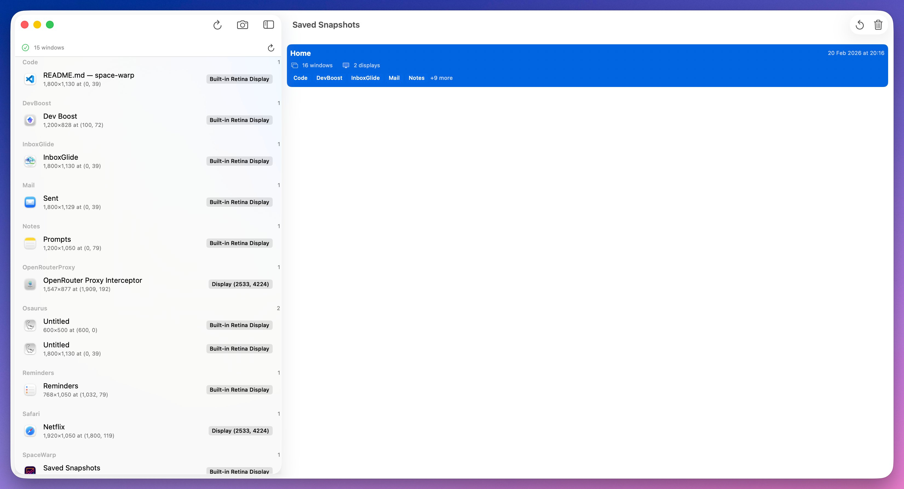

<p style="text-align: center;">
  
</p>
<h3 style="text-align: center;">SpaceWarp :: Name It, Save It, Warp Back Anytime</h3>

Save and restore your window layout, including position, size, and display assignment, as a quick snapshot.
Optimized for multi-display setups on macOS.



## Features

- Capture the current layout of your application windows (across multiple displays)
- Save layouts as named snapshots in a local SQLite database
- Restore layouts later, attempting to reopen and reposition windows
- Provide quick access via a menu bar icon and a main window
- Native macOS SwiftUI application with dark mode support
- Global keyboard shortcuts

## Requirements

- macOS 13.0 (Ventura) or later
- Apple Silicon or Intel Mac

## Installation

### Option 1: Build from Source

1. Clone the repository:
   ```bash
   git clone https://github.com/namuan/space-warp.git
   cd space-warp
   ```

2. Run the installation script:
   ```bash
   ./install.command
   ```

3. The app will be installed to `~/Applications/SpaceWarp.app`

### Option 2: Download Release

Download the latest release from the Releases page and move to your Applications folder.

## Permissions (macOS)

SpaceWarp needs the following permissions to function correctly:

1. **Accessibility** - Required to enumerate, activate, and move windows
2. **Screen Recording** - Required to read display information
3. **Automation** - Required to launch applications

Grant them in: **System Settings → Privacy & Security → Accessibility / Screen Recording**

The app will prompt for these permissions on first launch.

## Usage

### Basic Flow

1. Arrange your windows the way you like across your displays
2. Click **Save Snapshot** from the toolbar or menu bar
3. Give your snapshot a name
4. Later, restore the snapshot from the list or menu bar

### Keyboard Shortcuts

| Shortcut | Action |
|----------|--------|
| `Ctrl+Shift+S` | Save snapshot |
| `Ctrl+Shift+R` | Restore last snapshot |
| `Ctrl+Shift+M` | Show main window |

### Menu Bar

The menu bar icon provides quick access to:
- Save Snapshot
- Restore Last Snapshot
- Recent Snapshots list
- Settings
- Quit

### Main Window

- **Left Panel**: Shows currently open windows grouped by application
- **Right Panel**: Lists saved snapshots with details
- **Restore Report**: Shows results after restoring a snapshot

## Configuration

Settings are stored in macOS UserDefaults and can be configured via the Settings window:

### General

- **Start Minimized**: Launch app hidden
- **Launch at Login**: Automatically start on login
- **Show in Menu Bar**: Display menu bar icon

### Hotkeys

Configure keyboard shortcuts for:
- Save Snapshot
- Restore Last Snapshot
- Toggle Window Manager

### Display

- **Auto-adjust for missing displays**: Adapt snapshot when displays change
- **Prompt for missing displays**: Warn before restoring with different display setup

### Snapshots

- **Auto-save interval**: Automatically save snapshots (0 = disabled)
- **Maximum snapshots**: Limit number of stored snapshots
- **Confirm before restore**: Show confirmation dialog
- **Show restore report**: Display results after restoration

### Data Storage

- **Database**: `~/Library/Application Support/SpaceWarp/SpaceWarp.db`
- **Settings**: Stored in macOS UserDefaults (`com.spacewarp`)

## Troubleshooting

### App Won't Start

- Ensure you're running macOS 13.0 or later
- Try running from Terminal to see error messages:
  ```bash
  ~/Applications/SpaceWarp.app/Contents/MacOS/SpaceWarp
  ```

### Windows Not Capturing

1. Verify **Accessibility** permission is granted
2. Click **Refresh** in the toolbar
3. Make sure windows are visible (not minimized)
4. Some system windows and apps may not be capturable

### Windows Not Restoring

1. Check the restore report for details
2. Ensure the target app is running or can be launched
3. Some apps may not respond to window positioning commands

### Permission Issues

1. Open **System Settings → Privacy & Security**
2. Check **Accessibility** - SpaceWarp should be enabled
3. Check **Screen Recording** - SpaceWarp should be enabled
4. Restart the app after changing permissions

If permissions keep resetting:
```bash
# Reset permissions for SpaceWarp
tccutil reset Accessibility com.spacewarp
tccutil reset ScreenCapture com.spacewarp
```

### Multi-Display Issues

- Confirm macOS detects all displays correctly
- Check display arrangement in System Settings
- Create a fresh snapshot after changing display configuration

## Development

### Building

```bash
# Build debug version
swift build

# Build release version
swift build -c release

# Run tests
swift test

# Lint code
make lint
```

```
SpaceWarp/
├── Models/           # Data models (WindowInfo, DisplayInfo, Snapshot)
├── ViewModels/       # View state management
├── Views/            # SwiftUI views
├── Managers/         # Business logic (WindowManager, SnapshotManager)
├── Services/         # macOS API wrappers
├── Repositories/     # Data persistence
└── Utilities/        # Helpers and constants
```

### Dependencies

- [GRDB.swift](https://github.com/groue/GRDB.swift) - SQLite database
- [swift-log](https://github.com/apple/swift-log) - Logging
- [Defaults](https://github.com/sindresorhus/Defaults) - Settings management

## License

This project is licensed under the MIT License. See the [LICENSE](LICENSE) file for details.

## Support

For issues and feature requests, please open an issue in the repository.
